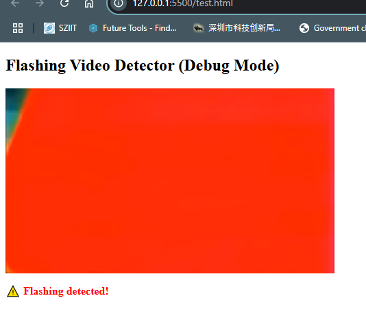

# FlashWatch: Real-Time Flashing Video Detector

⚡️ Detect flashing sequences in videos using real-time brightness analysis in the browser.  
Built to help identify potentially harmful content for photosensitive users (e.g. epilepsy-sensitive viewers).

## 🚀 Features

- Detects sudden changes in frame brightness using JavaScript and `<canvas>`
- Real-time detection while video is playing
- No dependencies — pure HTML + JS
- Instant visual alerts in the UI
- Works locally with proper CORS (via Live Server, WAMP, etc.)

## 🧪 Use Cases

- Accessibility testing for video content (WCAG 2.3.1 compliance)
- Detecting flashing/strobe effects in media uploads
- Browser-based analysis tool for educators, reviewers, or developers

## 🖥️ Demo

You can test it locally by serving the project with a local server (see below).

 <!-- Optional if you add a screenshot -->

## 🔧 How to Run

1. Clone the repo or download the files:
    ```bash
    git clone https://github.com/your-username/flashwatch.git
    cd flashwatch
    ```

2. Open the folder in VS Code and install the **Live Server** extension, or use any local server:
    ```bash
    # Example with Python 3
    python -m http.server 8000
    ```

3. Access the page in your browser:
    ```
    http://localhost:8000/test.html
    ```

> Note: Due to browser security policies, `canvas.getImageData()` requires the video to be served with proper CORS. This won’t work with `file:///` paths.

## 📦 Files

- `flash.html` – Main detection page with video and alert UI
- `videoplayback.mp4` – Sample video (replace with your own)
- `canvas` – Hidden canvas used for frame analysis

## 🧠 How It Works

The script captures each video frame and computes average brightness.  
If brightness changes by more than a defined threshold across multiple frames per second, a flash is flagged.

```js
Math.abs(currentBrightness - lastBrightness) > 50
